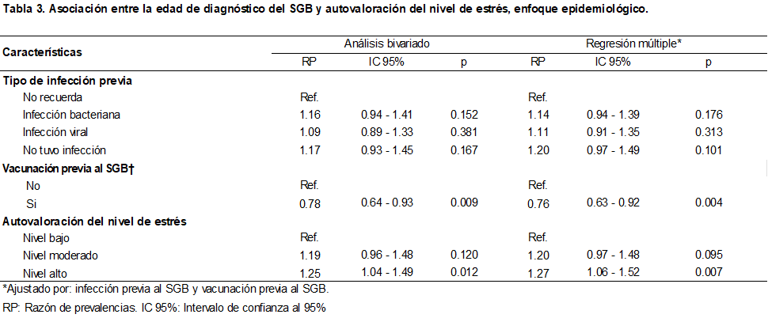

  

  <h3 align="center">Maestría en Epidemiología</h3>

  

  <h3 align="center">La autopercepción del nivel de estrés asociado a la edad de diagnóstico del Síndrome Guillain-Barré, estudio piloto en una población basada en internet de     América Latina y El Caribe.</h3>
   
  
  

    Investigador Principal: 
    David Chaupis Meza1.
    Asesor:
    Dr. Cesar Munayco2.
  

    Estudiante1
    Asesor2
    
  

    Afiliaciones institucionales:
    

      
 1. Facultad de Salud Pública y Administración, Universidad Peruana Cayetano Heredia.

      
 2. Center for Disease Control and Prevention, Peru.

     
    

    <a href="https://reponame/issues/new?template=bug.md">Report bug</a>
    ·
    <a href="https://reponame/issues/new?template=feature.md&labels=feature">Request feature</a>
  

## INDICE

- [Resumen](#resumen)
- [Abstract](#status)
- [Introducción](#whats-included)
- [Metodología](#bugs-and-feature-requests)
- [Resultados](#contributing)
- [Discusión](#creators)
- [Conclusiones](#thanks)
- [Recomendaciones](#copyright-and-license)
- [Referencias Bibliográficas](#copyright-and-license)
- [Anexos](#copyright-and-license)

## RESUMEN

Use `betterposter::poster_better()` to get an awesome poster generated from R Markdown!

## Features

Like many others, we saw Mike's [How to create a better research poster in less time](https://youtu.be/1RwJbhkCA58) video on Twitter and loved it. Like others, we thought: "let's bring that to R Markdown!". This is our version, but you may want to check out [posterdown] by Brent Thorne, where another version of the Better Scientific Poster can be found (including a portrait version).
